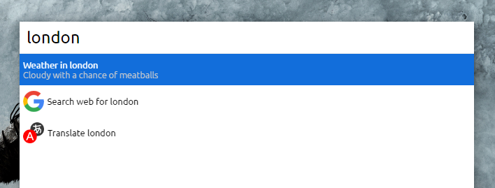
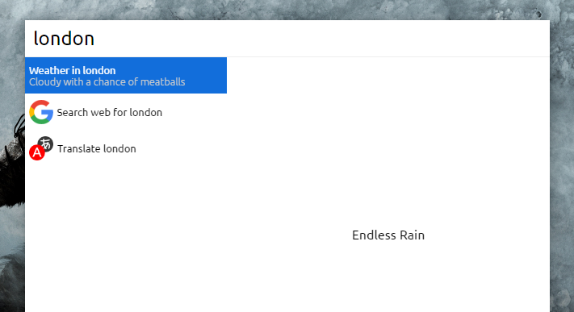
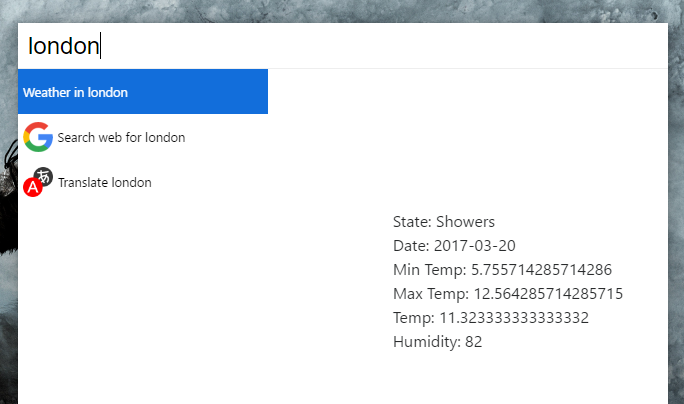
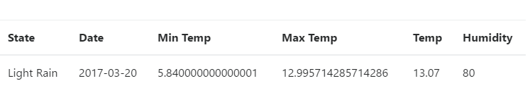
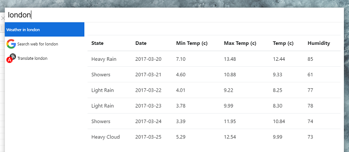
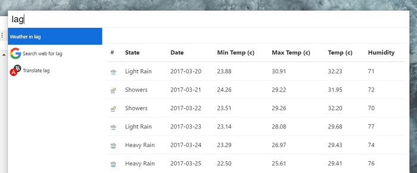

# Building Small Apps with React - Cerebro

[React](https://facebook.github.io/react/) is a fantastic piece of engineering that has allowed developers to implement declarative user interfaces that are easy to work with and reason about. It can be daunting on initial encounter ([JSX](https://facebook.github.io/react/docs/jsx-in-depth.html)), but the API surface is small and the concepts are few enough to allow developers get productive quickly. This series will primarily be a walkthrough of building small _useful_ apps with React (what did you expect?) and varied technologies while touching on useful concepts along the way. Strap in.

Often, tutorials start off with clichés like a Todo or Counter; these are useful for learning basic concepts, but are inadequate for our needs. We need something more challenging. Enter [Cerebro](https://github.com/KELiON/cerebro): a cross platform _extensible_ electron app that provides the perfect tools to build something small but useful with React. It has many [plugins](https://github.com/lubien/awesome-cerebro), some useful, and some not, but we are hopefully going to be contributing to the former category by creating a simple weather plugin.

To proceed, you need basic understanding of how React (surprise surprise), JavaScript, [JSON](http://www.json.org/) and [REST APIs](https://en.wikipedia.org/wiki/Representational_state_transfer) work. Without these you might struggle a bit, but fear not, the internet is a wonderful place with [lots](https://facebook.github.io/react/tutorial/tutorial.html) - [of](https://axiacore.com/blog/beginners-introduction-reactjs/) - [useful](https://www.codementor.io/reactjs/tutorial/the-reactjs-quick-start-guide) - [resources](https://github.com/enaqx/awesome-react#react-general-tutorials) to bring you up to speed.

Now we can do a bit of setup:

1. Download and install the most [recent version](https://github.com/KELiON/cerebro/releases) of Cerebro.
2. Follow the [instructions](https://github.com/KELiON/cerebro/blob/master/docs/plugins/boilerplate.md) on setting up a new plugin.
3. Read through the [plugin structure](https://github.com/KELiON/cerebro/blob/master/docs/plugins/plugin-structure.md) to get a good idea of what the plugin API allows.

Our plugin, **cerebro-weather**, will allow users to search for a city and then show a concise preview of the weather conditions of that city if it exists. This data will be powered by the excellent API from [MetaWeather](https://www.metaweather.com/api/). Start off by adding the following to your `index.js` file:

```jsx
export const fn = ({ term, display }) => {
  display({
    title: `Weather in ${term}`,
    subtitle: 'Cloudy with a chance of meatballs',
  })
}
```

This uses object destructuring, an ES2015 feature, to retrieve the `display` function and `term` from the scope object that is passed into the plugin by Cerebro. It is easier than always typing out `scope.display` or `scope.term`. If everything has been setup correctly, when you type in 'london' in Cerebro, you should see this:



[`fd738bd: Up and running`](https://github.com/BrainMaestro/cerebro-weather/commit/fd738bdeb7c0029ae392cc57a549fe501fa9a2c8)

Now, we can add a preview, which is where our plugin's UI will be displayed. Create a `preview.js` file and add the following to it:

```jsx
import React, { Component, PropTypes } from 'react'

export default class Preview extends Component {
  render() {
    const { city } = this.props

    return (
      <div>
        {city == 'london' ? 'Endless Rain' : 'Look Outside'}
      </div>
    )
  }
}

Preview.propTypes = {
  city: PropTypes.string.isRequired,
}
```

This is basic stuff. In this snippet, we are simply creating a react component that defines a `city` prop which is the `term` the user typed in passed from the index file. It renders a simple div with text. Update `index.js` to display the new preview:

```diff
+import React from 'react'
+import Preview from './preview'

export const fn = ({ term, display }) => {
  display({
    title: `Weather in ${term}`,
    subtitle: 'Cloudy with a chance of meatballs',
+    getPreview: () => <Preview city={term} />
  })
}
```

That should give us something like this:



[`37dce96: Dark and gloomy too`](https://github.com/BrainMaestro/cerebro-weather/commit/37dce96f6746d313dd2dc6787138cfd3652f6129)

With that done, we can now fetch (no pun intended) the actual data from MetaWeather with the [`fetch`](https://developer.mozilla.org/en-US/docs/Web/API/Fetch_API/Using_Fetch) API. Create an `api.js` file with the following:

```javascript
const BASE_URL = 'https://www.metaweather.com/api/location';

export const getWeather = city => {
  return fetch(`${BASE_URL}/search/?query=${city}`)
    .then(response => response.json())
    .then(results => fetch(`${BASE_URL}/${results[0].woeid}`))
    .then(response => response.json())
}
```

This function makes an initial request to the API to search for a given city. If the city exists, an array of locations is returned. We convert this response to JSON and retrieve the weather details for the first location with the location's `woeid`, which is its unique identifier and the only actual way to retrieve weather data from the API. This final response is then converted to JSON and displayed in a list in our `Preview` component.

```jsx
import React, { Component, PropTypes } from 'react'
import { getWeather } from './api'

const headers = {
  weather_state_name: 'State',
  applicable_date: 'Date',
  min_temp: 'Min Temp',
  max_temp: 'Max Temp',
  the_temp: 'Temp',
  humidity: 'Humidity',
}

export default class Preview extends Component {
  constructor(props) {
    super(props)
    this.state = {
      weather: null,
    }
  }

  componentDidMount() {
    getWeather(this.props.city).then(weather => this.setState({ weather }))
  }

  render() {
    if (! this.state.weather) return <div>Loading...</div>

    const weather = this.state.weather.consolidated_weather[0]

    return (
      <ul>
        {Object.keys(headers).map(metric => (
          <ul key={metric}>{`${headers[metric]}: ${weather[metric]}`}</ul>
        ))}
      </ul>
    )
  }
}

Preview.propTypes = {
  city: PropTypes.string.isRequired,
}
```

This gets the weather data with our API function, and displays the first consolidated weather report. Eventually, we will display all the available weather reports. This is what we should have now:



[`d144c25: The Awwward is coming home`](https://github.com/BrainMaestro/cerebro-weather/commit/d144c2512b12e44b8cac8c02359e79aa653031f9)

The data returned from our API call contains more information than we need, so with `headers` object, we will filter out just the data we need; this is a recurring theme when consuming external REST APIs.

Our app is in desperate need of styling, so let us pull in a package to help with that. Run `npm install bootstrap@4.0.0-alpha.6 --save`. Import boostrap css with `import styles from 'bootstrap/dist/css/bootstrap.css'`, and change the return part of the render function to:

```jsx
return (
  <table className={styles.table}>
    <thead>
      <tr>
        {Object.keys(headers).map(header => <th key={header}>{headers[header]}</th>)}
      </tr>
    </thead>
    <tbody>
      <tr>
        {Object.keys(headers).map(metric => (
          <td key={metric}>{weather[metric]}</td>
        ))}
      </tr>
    </tbody>
  </table>
)
```

If you were wondering, what `className={styles.table}` is, it is a [CSS Module](https://github.com/css-modules/css-modules) one of the many ways of styling in React. Okay, detour over. Now we have a much better looking app.

[`4de443d: Too many zeroes`](https://github.com/BrainMaestro/cerebro-weather/commit/4de443d3ec85b29d3fa1ff2804a0e54235ec6540)

We can now focus on rendering the remaining weather reports. For brevity, I will only include the changes.

```javascript
const weatherReports = this.state.weather.consolidated_weather
```

```jsx
<tbody>
  {weatherReports.map((report, index) => (
    <tr key={index}>
      {Object.keys(headers).map(metric => {
        let value = report[metric]
        if (typeof value == 'number' && value % 1 != 0) {
          value = value.toFixed(2)
        }

        return <td key={metric}>{value}</td>
      })}
    </tr>
  ))}
</tbody>
```

In the first snippet, we stop picking the first element of the `consolidated_weather` array and choose the entire thing instead. In addition to displaying the extra reports, the function now formats decimal numbers to only two decimal places. This gives us:



[`b6419d6: The more the merrier`](https://github.com/BrainMaestro/cerebro-weather/commit/b6419d6c2a0af8dd4add89513dbc61b09f285a96)

which you have to admit is much nicer and actually useful. Also, A minor change was made to the temperature header to add the unit `(c)`. While this is great, we can make one more tweak to improve the general look and experience. Add a new header to the top of our headers object `weather_state_abbr: '#'`. This will be used to display a small image representation of the weather state. Add the following to your render function just under the first `if` statement for formatting decimals.

```jsx
if (metric == 'weather_state_abbr') {
  value = 
}
```

This uses an SVG image from MetaWeather to give us:



[`7cc836c: Exit stage left`](https://github.com/BrainMaestro/cerebro-weather/commit/7cc836ce6980b5ee80b6461e36b00be8ff75999b)

Pretty good! We have done a lot, but as always with software, it can be improved further. Showing the city and country would be a start, along with time zone, but I will leave those for the reader to implement. Suggestions, feedback and PRs are welcome at the [github repo](https://github.com/BrainMaestro/cerebro-weather/). Thanks for reading.
